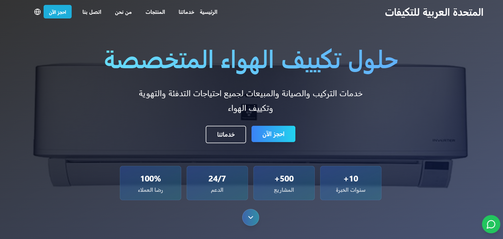

<h1 align="center">❄️ المتحدة العربية التكييفات | Air Conditioning Company Website</h1>

  موقع متكامل لشركة متخصصة في بيع وصيانة وتركيب أجهزة التكييف، يتميز بتصميم عصري، أداء عالي، وتجربة مستخدم متميزة.

---

## ✨ المميزات الرئيسية

- 🎯 **واجهة سهلة الاستخدام** وتصميم متجاوب يعمل بسلاسة على جميع الأجهزة.
- 📦 **عرض تفصيلي للمنتجات** مع صور عالية الجودة، الأسعار، والمواصفات الفنية.
- 🧰 **خدمة طلب التركيب والصيانة** مدمجة بنموذج تفاعلي.

- 📬 **نموذج تواصل مباشر** مع إدارة الشركة أو فريق الدعم.
- 🌍 دعم متعدد اللغات .

---

## 🚀 التقنيات المستخدمة

| المجال              | الأدوات والتقنيات                           |
|----------------------|---------------------------------------------|
| الهيكل العام (Frontend) | HTML5, CSS3, JavaScript, Bootstrap 5        |
| تصميم متجاوب         | Media Queries, Flexbox, Grid                |
| التفاعل والديناميكية | JavaScript Vanilla / jQuery *(اختياري)*     |                |
| قواعد البيانات       | MySQL / MongoDB *(حسب المتطلبات)*           |
| تحسين الأداء         | Lazy Loading, Image Optimization            |
| SEO                  | Meta Tags, Structured Data, Sitemap         |

---

## 📁 هيكل المشروع

air-conditioning-website/
│
├── index.html 
├── products.html 
├── contact.html 
├── service-request.html 
├── css/
│ └── style.css
├── js/
│ └── main.js 
├── images/
│ ├── logo.png
│ └── products/
│ └── ac-model1.png
├── assets/
│ └── fonts/
│ └── icons/
└── README.md

---

## 📸 صورة من الواجهة

  

---

## 📞 بيانات التواصل

**شركة المتحدة للتكييفات**  
📍 القاهرة - مصر  
📧 saeedahmee222@gmail.com 
📞 01155331256 
🌐 [https://www.facebook.com/share/16GRGhggkS/]

---
## 📝 الرخصة
هذا المشروع مرخص تحت رخصة [MIT License](LICENSE)، ويمكن استخدامه أو تعديله بحرية مع الحفاظ على الحقوق.

> Developed with passion by <b></b>Fares Ahmed </b>